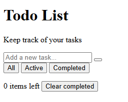

# 📝 Week 1: Introduction to Web Development & HTML Basics

📅 **Date**: April 4, 2025
🎯 **Goal**: Understand how the web works and learn HTML structure.

## 📋 Topics Covered

- 🌐 What is web development? (Frontend vs. Backend)
- 🔄 How websites work (browsers, servers, and HTTP requests)
- 💻 Setting up a development environment
- 🏗️ HTML elements, structure, and forms

## 🏠 Homework Assignment

### Todo List Web Page

Create a simple todo list web page using **only HTML** (no CSS or JavaScript yet). Your page should:

1. Have a proper HTML structure with doctype, html, head, and body tags
2. Include a title, headings, and appropriate semantic HTML elements
3. Implement a todo list that visually resembles the example image below:

Your todo list should include:

- A heading "Todo List"
- A subheading "Keep track of your tasks"
- An input field to add new tasks
- Buttons for filtering tasks (All, Active, Completed)
- A way to display the number of remaining items
- A "Clear completed" option

### Required Elements

- Use appropriate HTML form elements
- Include proper semantic HTML5 tags (header, main, footer, etc.)
- Add some sample todo items in the list
- Make sure your HTML is well-indented and formatted
- Add comments to explain the purpose of different sections

### Additional Resources

For more information about this assignment, please refer to the Confluence page:
[Frontend - Week 1](https://tkukampfportal.atlassian.net/wiki/spaces/TK/pages/6652089/Frontend+-+Week+1)

## 📤 Submission Guidelines

1. Create a folder with your name in the `beginner/week-1/` directory
2. Add your HTML file(s) to this folder
3. Include a brief README.md describing your approach and any challenges you faced
4. Submit your work following the git workflow described in the main README
5. Remember to submit at least ONE DAY BEFORE our next session

## 🌟 Evaluation Criteria

- ✅ Correct HTML structure and syntax
- 🔍 Appropriate use of semantic HTML elements
- 📐 Organization and readability of code
- 📋 Completeness of the todo list functionality (in HTML)
- 📚 Documentation and comments

## 💡 Tips

- Focus on structure rather than appearance for now
- Use HTML elements like `<input>`, `<button>`, and `<ul>/<li>` for your todo list
- Remember that we're not using CSS or JavaScript yet, so focus on clean, semantic HTML
- Review the lecture slides before starting your homework

Good luck with your first assignment! 💪
