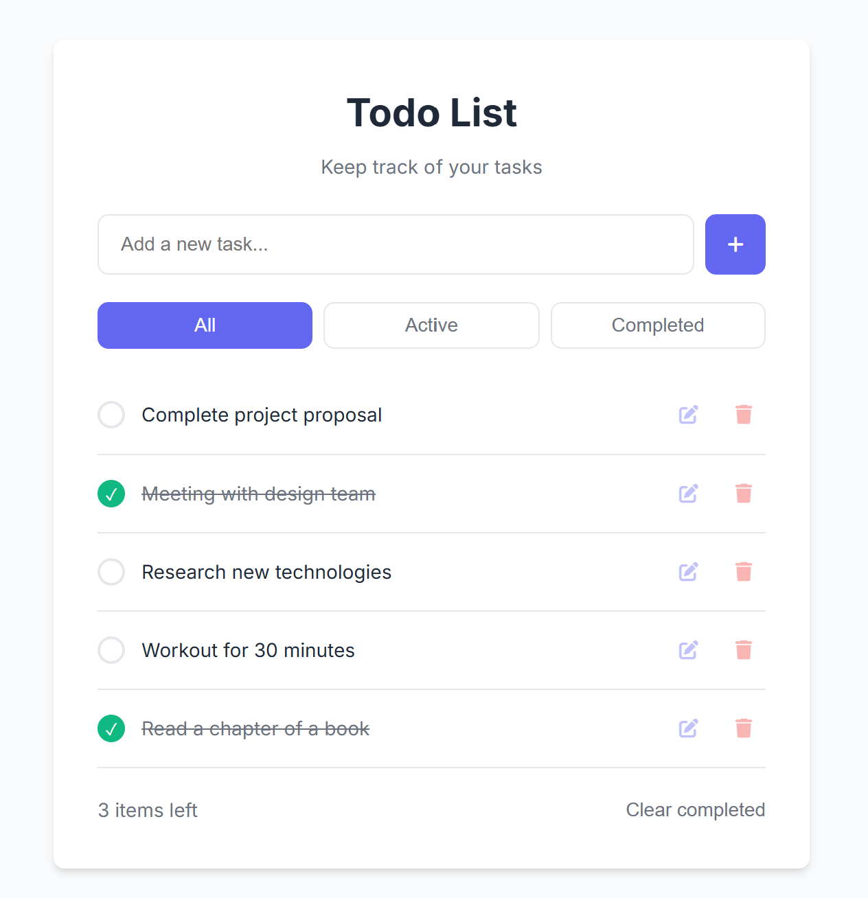

# 📝 Week 2: CSS Fundamentals & Styling Web Pages

📅 **Date**: April 11, 2025
🎯 **Goal**: Learn how to style HTML elements with CSS and create visually appealing web pages.

## 📋 Topics Covered

- 🎨 Introduction to CSS and its purpose
- 🔗 Different ways to include CSS in HTML
- 📊 CSS selectors and specificity
- 📏 Box model, layout, and positioning
- 🌈 Working with colors, fonts, and styling elements

## 🏠 Homework Assignment

### Styling Your Todo List

Take the HTML todo list you created in Week 1 and style it using CSS to make it visually appealing. Your styled todo list should:

1. Follow the provided style guide (see image in assets folder)
2. Implement responsive design principles
3. Use appropriate color schemes, typography, and spacing
4. Include hover states and visual feedback for interactive elements



Your styled todo list should include:

- A clean, modern visual design
- Consistent color scheme and typography
- Proper spacing and alignment of elements
- Visual distinction between different types of tasks (completed vs active)
- Responsive layout that works on different screen sizes

- Use appropriate CSS selectors (class, ID, element)
- Implement the box model correctly for spacing
- Add comments to explain your CSS choices
- Include at least one CSS animation or transition effect

### Additional Resources

For more information about this assignment, please refer to the Confluence page:
[Frontend - Week 2](https://tkukampfportal.atlassian.net/wiki/spaces/TK/pages/12812293/Week+2+-+Beginner+-+Frontend+Documentation)

## 📤 Submission Guidelines

1. Create a folder with your name in the `beginner/week-2/` directory.
2. Copy your index.html file from week-1 to your week-2 folder.
3. Create a new `style.css` file in your week-2 folder.
4. Link your CSS file to your HTML file by adding the following line in the `<head>` section of your index.html:

   ```html
   <link rel="stylesheet" href="style.css" />
   ```

5. Submit your work following the git workflow described in the main README.
6. Remember to submit at least ONE DAY BEFORE our next session.

## 🌟 Evaluation Criteria

- ✅ Proper CSS syntax and organization
- 🎯 Adherence to the provided style guide
- 🔍 Appropriate use of CSS selectors and properties
- 📐 Responsive design implementation
- 📋 Visual improvement of the todo list
- 📚 Documentation and comments

## 💡 Tips

- Use CSS classes to style different elements consistently
- Remember to consider different screen sizes when styling
- Use CSS variables for colors and repeated values
- Test your design on different browsers if possible
- Keep your CSS organized and well-commented
- Review the lecture slides before starting your homework

Good luck with styling your todo list! 💅
